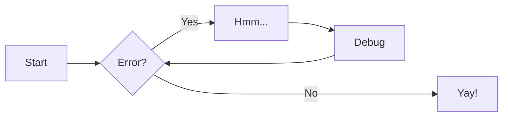

# Mermaid diagrams

Here's the example from [MkDocs Material documentation](https://squidfunk.github.io/mkdocs-material/reference/diagrams/#using-flowcharts): 




```
markdown_extensions:
  - pymdownx.superfences:
      custom_fences:
        - name: mermaid
          class: mermaid
          format: !!python/name:pymdownx.superfences.fence_code_format
```


