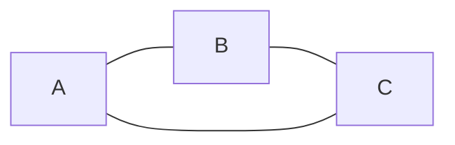

# Optional Topic:  Graph Theory

!!! Definition - Graph
	A set of vertices and a set of edges formed between vertices. Analogy:  Think of these objects like networks or connections between locations. These are **not** the same as graphs of equations / functions and are **not** bar graphs, pie graphs, etc.

!!! Example - Graph
	Given three vertices $\{A, B, C\}$, the following edges $\{AB, BC, AC\}$ connect our vertices to form a graph. Below is a visual which simplifies the math speak and is what you should really be visualizing when reading the math speak:

