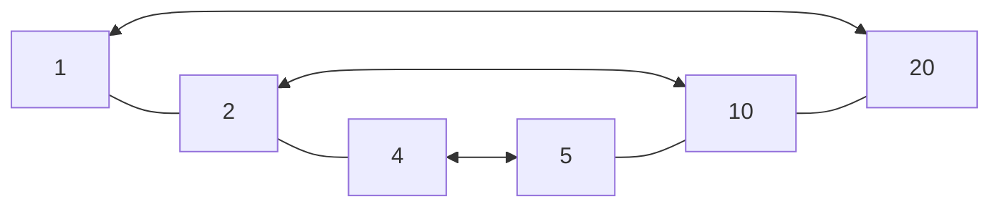

## Definition

A **factor** is a whole number that divides another number so that the [[Quotient]] is also a whole number.

## Example

$$(4)(5)=20$$
$4$ and $5$ are both factors of 20 but are not the only factors of 20. Here are all the positive factors of 20:
$$1,2,4,5,10,20$$
Please note that factors come in *pairs*, i.e. $1\times20=20$ means $1$ and $20$ are paired together.

We can represent a list of factors as a **Factor Rainbow** which helps identify when we are *finished* finding factors of an integer. For the above example we can notice that 4 and 5 are [[Consective|consecutive]] that there can be no factors between them and each factor is paired with one other factor. If we were missing any, it would have to be 3 but we know 3 does not divide 20 with no remainder.

## Related Words

Prime Number, Quadratic, Order of Operations