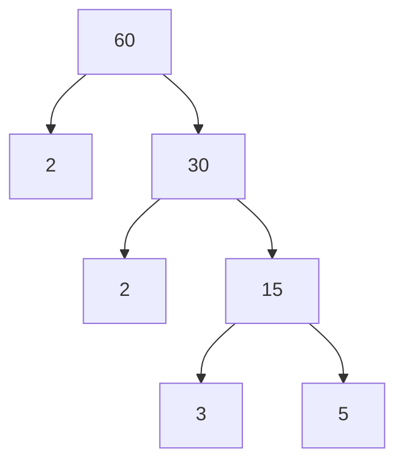

![[Factor#Definition]]
## Problem Set
#### Q2-00
For each number, list all of the factors:
	a) 10
	b) 20
	c) 16
	d) 60
	e) 144
[Solution](#S2-00)

#### Q2-01
State the prime factorization of each composite number and provide a prime factor tree for part (c)
	a) 18
	b) 21
	c) 60
[Solution](#S2-01)

## Solution Set

#### S2-00
	a) 1,2,5,10
	b) 1,2,4,5,10,20
	c) 1,2,4,8,16
	d) 1,2,3,4,5,6,10,12,15,20,30,60
	e) 1,2,4,6,8,12,18,24,36,72,144
#### S2-01
	a) 18 = 2*9 = 2*3*3
	b) 21 = 3*7
	c) 60 = 2*30 = 2*2*15 = 2*2*3*5

#### S2-02
