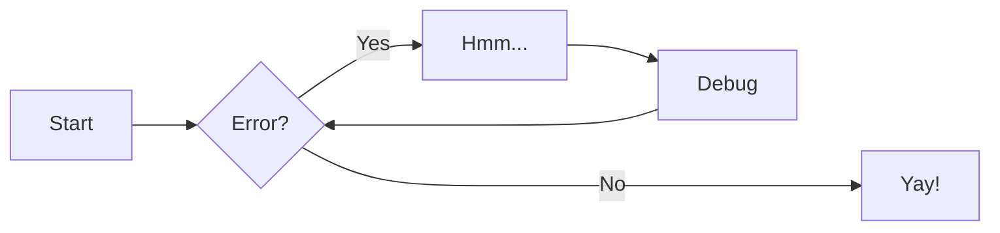
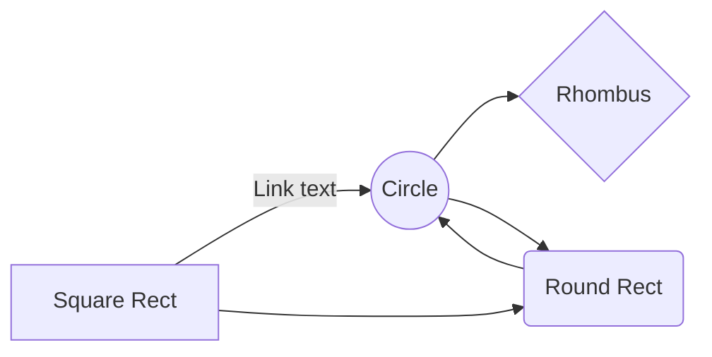

# Mermaid diagrams

Here's the example from [MkDocs Material documentation](https://squidfunk.github.io/mkdocs-material/reference/diagrams/#using-flowcharts): 

```mermaid
graph LR
  A[Start] --> B{Error?};
  B -->|Yes| C[Hmm...];
  C --> D[Debug];
  D --> B;
  B ---->|No| E[Yay!];
```

```mermaid
graph LR
    A[Square Rect] -- Link text --> B((Circle))
    A --> C(Round Rect)
    B --> D{Rhombus}
    B --> C
    C --> B
```
