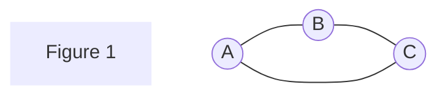
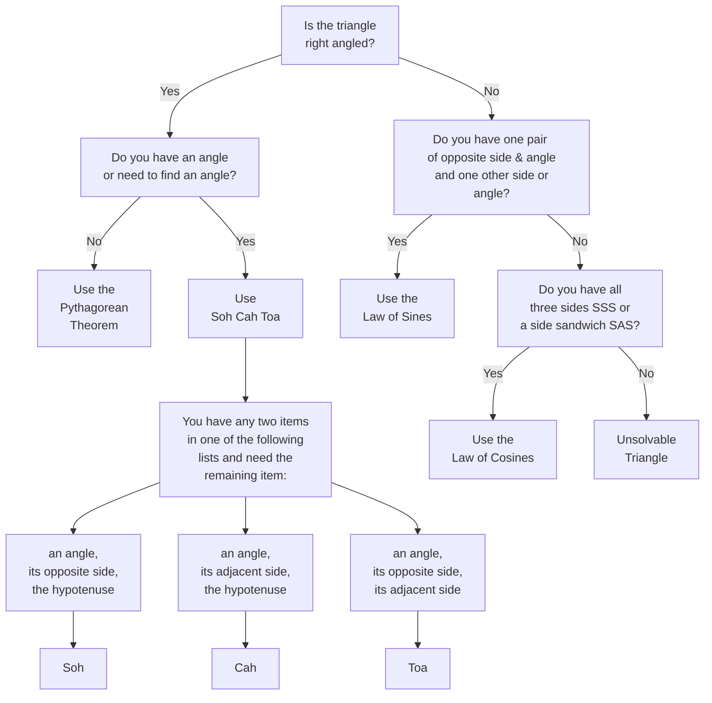

# Optional:  Graph Theory

## Graphs - no, not *those* graphs

Tags #optional #supplementary #enrichment #coding

## Introductory Remarks

!!! Definition
	A *graph* is a set of vertices and a set of edges formed between vertices. **Analogy:**  Think of these objects like networks or connections between locations. These are **not** the same as graphs of equations / functions and are **not** bar graphs, pie graphs, etc.

!!! Example
	Given three vertices $\{A, B, C\}$, the following edges $\{AB, BC, AC\}$ connect our vertices to form a graph. Figure 1 is a visual which simplifies the math speak and is what you should really be visualizing when reading the sets. This is one of many topics in math where it is better to visualize the idea rather than be bogged down in the notation used to describe it in text.

Graphs are a topic primarily seen in coding but are used frequently to summarize in a math class. Importantly, students need to be taught to use graphs, such as [**flowcharts**](Flowcharts.md), and it cannot be assumed the knowledge of graphs is intuitive. Here is the most common example I have seen flowcharting used to summarize without explanation:  while discussing how to decide which trig formula to use in Grade 11 courses for right or [oblique](Trigonometry#Beyond Pythagorean Theorem) triangles.

