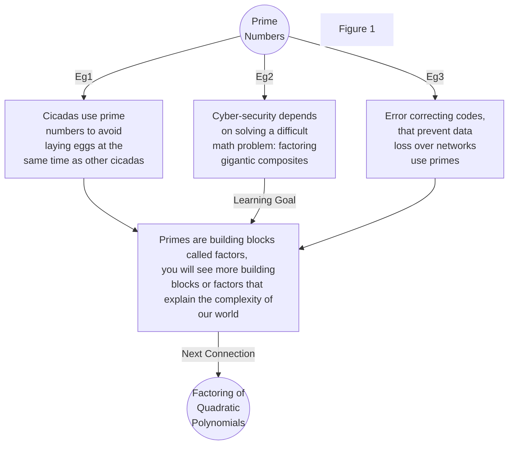

# Homepage

## Ontario Math Graph (OMG)

### Author:  k.cluchey.ca

I need help creating this free resource. Correcting errors or making quick suggestions is as easy as emailing me k@cluchey.ca but please consider forking my public [Github Repo](https://github.com/kluchey/ont-math-graph) for yourself and submitting a pull request. [[Contribute|Click here for an article describing how to contribute to the Ontario Math Graph.]]

This resource is built using Markdown files and a free markdown-to-html builder called [MkDocs](https://www.mkdocs.org/) and [Material for MkDocs](https://squidfunk.github.io/mkdocs-material/). It is hosted on Github using Github Pages. I personally use [Obsidian](https://obsidian.md) to create the Markdown (.md) files for publishing.

# Design Philosophy

This resource exists for many reasons but primarily acts as a second brain for Mr. Cluchey (he/him/me/I) so I can visualize and communicate the importance of connections made between math courses in Ontario, Canada.

It is an attempt at putting together a [[Graph Theory#Introductory Remarks|graph]] of essential skills to teach math (as an Ontario Secondary School Teacher). Why do this? I conjecture that all lessons in math can be optimized. Why should we recreate [[Factoring|factoring]] lessons when the skill is taught almost universally the same way across the province, maybe worldwide? Can we not, instead, focus on bringing relevant applications and [[Proof|corollaries]] of factoring to our personal group of students through practice and play? If we want to focus on Culturally Relevant Pedagogy, we need to get rid of the overhead of well-cooked examples and painfully verbose procedures to approach the topic in a way that best appreciates our learners.

I propose the solution is this graph:  a network of resources where eventually, to teach the topic of factoring, the Grade 8 teacher knows that [[Prime Numbers|Prime and composite numbers]] must be taught to give numerical examples of factors so the more abstract [[Polynomials|polynomial factors]] in Grades 10 and 11 can build upon a strong foundation. Further, in each topic and skill, we should see culturally relevant examples, applications, and games that take the optimized set of problems in a variety of directions but ultimately achieve the same goal (as in Figure 1). Your only job as math teacher should be to select the lesson that is most relevant for your group, and of course be able to respond to student questions / problems.

!!! Note
	In an effort to be well-researched and relevant, I will attempt to reference pedagogy and paradigm where I feel it is most relevant. The core resource is still a set of tested, cooked, and worked math examples that, taken on their own, can teach anyone the skills from Grade 1 to 12. Lesson plans provided will tend to divide more users of this resource but the core is still meant to be in a neutral, remixable state from the outset.

Figure 1 can be thought of as a small section of a larger graph, where each vertex is its own resource. "Go here to learn about Cyber-Security" or "Go here to learn about worked Prime Number problems". Imagine now the completed graph and just how big this picture is for all of our math education in Ontario. That is the Ontario Math Graph and it will illustrate how grades, courses, skills, and topics all connect and flow into one another so that (hopefully) anyone (teacher, parent, student) can view and understand the importance of each skill as early as Grade 1 when students learn about their first [[Group Theory|mathematical group]], i.e. addition over the integers. Additionally, I hope this graph will eventually be helpful for decision making:

*  We're on a time limit... Which topics *can* be cut, which need to stay?
*  Where can I find resources quickly to teach a lesson? This database is **searchable**.
*  I'm a student - where can I go to find information about skills I need to be successful in the next grade or post-secondary?
*  I'm a teacher - how can I stay organized and ensure my students have learned enough to progress to the next grade or post-secondary?

~ Mr. Cluchey