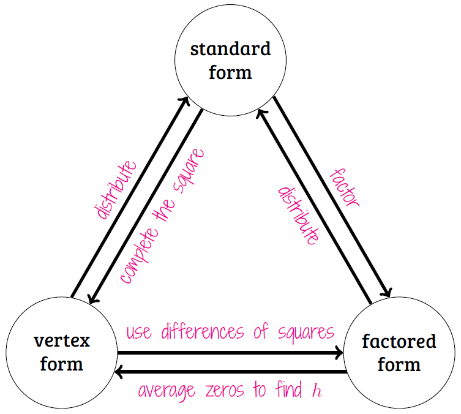

alias:: MCV4U 5-2i, CV5-2i

- # This Practice Builds
	- Complete each problem in the order given.
	  ---
	- Draw diagrams for these scenarios.
	  logseq.order-list-type:: number
		- An airplane, $$\vec{p}$$, is flying and there is wind, $$\vec{w}$$. The airplane wants to travel to a location $$[\text{N}8^\circ E]$$ of where it is currently located. Also draw the resultant, $$\vec{r}$$.
		  logseq.order-list-type:: number
			- Solution.
				- Answers may vary since $\vec{p}$ and $\vec{w}$ do not have defined directions. Can you draw this diagram in
		- A person, $$\vec{p}$$, is swimming and there is a current, $$\vec{c}$$. The person wants to travel to a location $$[\text{N}30^\circ E]$$ of where they are currently located. Also draw the resultant, $$\vec{r}$$.
		  logseq.order-list-type:: number
		- A person, $$\vec{p}$$, is swimming and there is a current, $$\vec{c}$$. The person's position is $$[\text{N}40^\circ E]$$ from where their destination is located. Also draw the resultant, $$\vec{r}$$.
		  logseq.order-list-type:: number
		  ---
		- [[draws/2025-05-23-07-36-10.excalidraw]]
		  logseq.order-list-type:: number
		- *Compare*:  What do all of these problems have in common?
		  logseq.order-list-type:: number
		- *Contrast*:  What is different between these problems?
		  logseq.order-list-type:: number
		- *Strategize*:  How do we phrase each problem with vectors? Is this a shared strategy or do the strategies differ?
		  logseq.order-list-type:: number
		- logseq.order-list-type:: number
		  ---
	- i) Draw a graph/diagram and determine a vector equation for these **lines**.
	  logseq.order-list-type:: number
	  ii) Be as *efficient* as possible with your solution; list the number of steps you took to complete each problem.
		- logseq.order-list-type:: number
		  $$y=3x+4$$
		  ---
		- logseq.order-list-type:: number
		  $$3x-4y+5=0$$
		  ---
		- logseq.order-list-type:: number
		  $$\text{Let } t\in \R \text{ then } x = 3-4t \text{ and } y=4-3t$$
		  ---
		- logseq.order-list-type:: number
		  $$\frac{x-4}{3}=\frac{y+3}{-4}$$
		  ---
		- logseq.order-list-type:: number
		  $$\frac{x-4}{3}=y+3$$
		  ---
		- logseq.order-list-type:: number
		  $$\frac{x-4}{3}=\frac{y+3}{-4}=\frac{z+2}{5}$$
		  ---
		- This line is ==[[parallel]]== to $$3x-4y+5=0$$ and contains the point $$(3,4)$$.
		  logseq.order-list-type:: number
		  ---
		- This line is parallel to $$6x-8y+10=0$$ and contains the point $$(3,4)$$
		  logseq.order-list-type:: number
		  ---
		- This line is ==[[perpendicular]]== to $$3x-4y+5=0$$ and contains the point $$(3,4)$$
		  logseq.order-list-type:: number
		  ---
		- This line intersects the xy-plane at the z-axis and has a direction vector of $$\begin{bmatrix} 4 \\ -3 \\ 5 \end{bmatrix}$$.
		  logseq.order-list-type:: number
		  ---
		- This line passes through points $$(1,2,3)$$ and $$(-5,-4,-3)$$.
		  logseq.order-list-type:: number
		  ---
		- This line ==[intersects]([[intersection]])== the **Line A**: 
		  logseq.order-list-type:: number
		  $$A = (-1,2,3) + k(3,2,1), k\in \R$$
		  on the yz-plane and the **Line B**:
		  $$B = (6,5,4) + t(4,3,-5), t \in \R $$
		  on the xz plane.
		  ---
		- This line is perpendicular to both lines A and B and contains the origin, $$t,k\in \R$$
		  logseq.order-list-type:: number
		  $$A = (0,0,1)+t(1,-1,2)$$
		  $$A = (1,0,0)+k(-1,1,2)$$
		- ---
	- ## Consolidate
		- In which problems today did you see...
		  logseq.order-list-type:: number
			- Vector Addition?
			  logseq.order-list-type:: number
			- Vector Subtraction?
			  logseq.order-list-type:: number
			- A position vector?
			  logseq.order-list-type:: number
			- A direction vector?
			  logseq.order-list-type:: number
			- A scalar equation?
			  logseq.order-list-type:: number
			- A symmetric equation?
			  logseq.order-list-type:: number
			- Parametric equations?
			  logseq.order-list-type:: number
			- A normal vector?
			  logseq.order-list-type:: number
			- ---
		- Is the point $$(1,4,-6)$$ on the line $$\vec{v}=(-3,-2,8)+t(2,3,0)$$?
		  logseq.order-list-type:: number
		  ---
		- Is it possible to create a scalar equation for a line in $$\R^3$$? Why or why not? What questions does drawing a diagram of a line in 3D raise when you consider making the scalar equation? Hint:  Normal Vector.
		  logseq.order-list-type:: number
		  ---
		- What do you know about every vector located on the xy-plane? yz-plane? xz-plane?
		  logseq.order-list-type:: number
		  ---
		- Create a relational graph for converting between forms of equations for lines in *2D*.  Here is a relational graph for forms of quadratic equations as an example. Is your relational graph also a Triangle?
		  logseq.order-list-type:: number
		  {:height auto, :width 400} 
		  ---
		- Create a relational graph for converting between forms of equations for lines in *3D*.
		  logseq.order-list-type:: number
		  ---
		- logseq.order-list-type:: number