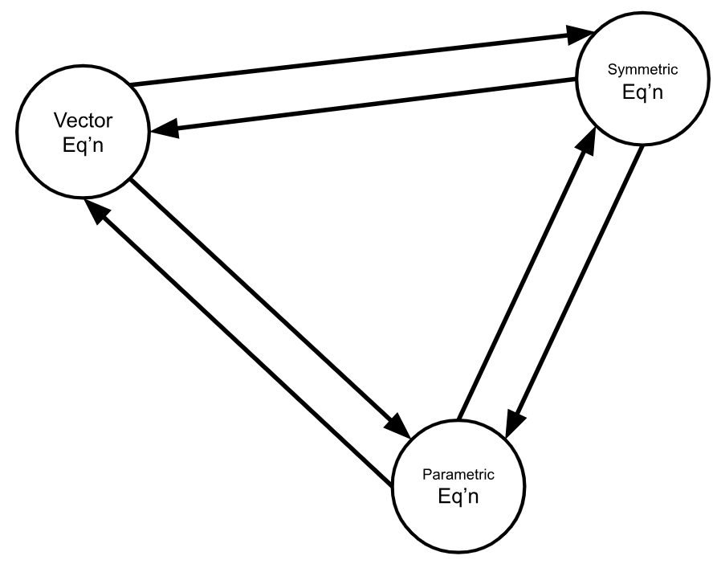
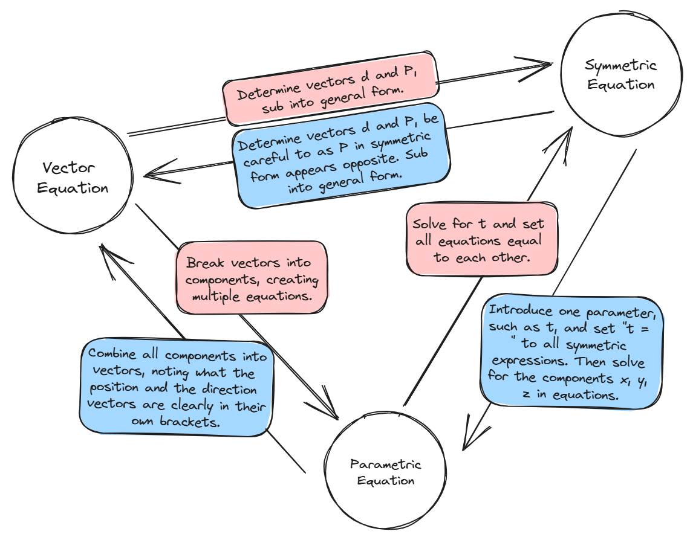

# Review Problem Set
	- Topic:  Forms of Equations in 3D
	  logseq.order-list-type:: number
		- Determine the vector, parametric, and symmetric equations of the line through the points $A(3, -1, 5)$ and $B(-4, 5, -9)$.
		  logseq.order-list-type:: number
			- *Solution*.
			  logseq.order-list-type:: number
			  collapsed:: true
				- Begin by finding the direction of the line, $\vec{d}$. Since the line travels between points $A$ and $B$ we reason that:
				  logseq.order-list-type:: number
				  $$\begin{align*}
				  \vec{d} &= \vec{AB} \\
				  &= \vec{B} - \vec{A} \\
				  &= \begin{bmatrix} -4 \\ 5 \\ -9 \end{bmatrix} - \begin{bmatrix} 3 \\ -1 \\ 5 \end{bmatrix} \\
				  &= \begin{bmatrix} -4 - 3 \\ 5 - (-1) \\ -9 - 5 \end{bmatrix}  \\
				  &= \begin{bmatrix} -7 \\ 6 \\ -14 \end{bmatrix} 
				  \end{align*}$$
				- The position vector $\vec{P}$ can be any point on the line, including $A$ or $B$ so without loss of generality we let $\vec{P}=A=(3,-1,5)$.
				  logseq.order-list-type:: number
				- We need a parameter, so let $t\in\R$.
				  logseq.order-list-type:: number
				- Therefore a vector equation is:
				  logseq.order-list-type:: number
				  $$\vec{v}=(3,-1,5) + t(-7,6,-14)$$
				  This solution is not ==[[unique]]==.
		- Complete this relational graph for the various forms of a line in $\R^3$ by annotating the arrows. Note:  Arrows are a short few words to describe the **process(es)** or **step(s) you perform** to go between forms in a specific direction.
		  logseq.order-list-type:: number
		  {:height 350, :width 442}
			- *Solution*.
			  logseq.order-list-type:: number
			  collapsed:: true
				- {:height 583, :width 728}
				  logseq.order-list-type:: number
				  <!-- [[draws/2025-05-22-15-10-22.excalidraw]] -->
		- Why is there no scalar equation for a line in $\R^3$? Hint:  {{cloze Can you draw a diagram to help you figure out and describe what problems someone would have forming a scalar equation of a line in 3D?}}
		  logseq.order-list-type:: number
		  ---
	- Topic:  Points of Intersection in 3D
	  logseq.order-list-type:: number
		- Determine the point of intersection for the following system of equations in $\R^3$. $t,k\in\R$
		  logseq.order-list-type:: number
		  $$\begin{cases} L_1: & \frac{x-1}{2}=\frac{y+2}{-1}=\frac{z-2}{4} \\ L_2: & \vec{r}(t)=\langle 3,0,-2 \rangle +t\langle -2,-1,6 \rangle \end{cases}$$
			- *Solution*.
			  logseq.order-list-type:: number
				- Having the lines in two different forms is a tad inconvenient compared to our lesson from class but can still work for us. Let $\vec{r}(t)=\langle x,y,z \rangle$.
				  logseq.order-list-type:: number
				- Now, the parametric equations for $L_2$ are: 
				  logseq.order-list-type:: number
				  $$\begin{gather} x =3-2t \\ y =-t \\ z =-2+6t  \end{gather}$$
				  Let's substitute $(1)$ and $(2)$ into $k=\frac{x-1}{2}=\frac{y+2}{-1}$
				- We get:
				  logseq.order-list-type:: number
				  $$\frac{(3-2t)-1}{2} = \frac{(-t)+2}{-1}$$
				- Simplifying:
				  logseq.order-list-type:: number
				  $$\begin{align*}
				  \frac{3-2t-1}{2} &= \frac{-t+2}{-1} \\
				  \frac{2-2t}{2} &= t-2 \\
				  1-t &= t-2 \\
				  1+2 &= t+t \\
				  3 &= 2t \\
				  \frac{3}{2} &= t \\
				  \end{align*}$$
				- We need to make use of all the equations eventually, so let's use $t=\frac{3}{2}$ to get what we believe is our Point of Intersection:
				  logseq.order-list-type:: number
				  $$\begin{align*}
				  \vec{r}(t) &=\langle 3,0,-2 \rangle +t\langle -2,-1,6 \rangle \\
				  \vec{r}\left(\frac{3}{2}\right) &=\langle 3,0,-2 \rangle +\left(\frac{3}{2}\right)\langle -2,-1,6 \rangle \\ 
				  &=\langle 3-3,-\frac{3}{2},-2+9 \rangle \\
				  &=\langle 0,-\frac{3}{2},7 \rangle 
				  \end{align*}$$
				- Since we found this point using $L_1$, now we need to check that this point also satisfies $L_2$. If there is no point of intersection, this check will fail.
				  logseq.order-list-type:: number
				  $$\begin{gather*}
				  \frac{x-1}{2}=\frac{y+2}{-1}=\frac{z-2}{4} \\
				  \frac{(0)-1}{2}=\frac{\left(-\frac{3}{2}\right)+2}{-1}=\frac{(7)-2}{4} \\
				  \frac{-1}{2}=\frac{\left(-\frac{1}{2}\right)}{-1}=\frac{}{4} \\
				  \end{gather*}$$
				- logseq.order-list-type:: number
		- In his handout, Mr. Cluchey messed up and wrote $\langle -2,-1,-6 \rangle$, introducing an extra negative. Does this new, erroneous system still have a point of intersection or is it skew?
		  logseq.order-list-type:: number
		- Determine the point of intersection for the following system of equations in $\R^3$. $t,k\in\R$
		  logseq.order-list-type:: number
		  $$\begin{cases} L_3: & \{ x=1-k, 2y=k+1, z=2-2k \} \\ L_4: & \langle \frac{1}{2},\frac{3}{4},1 \rangle +t\langle 2,-1,4 \rangle \end{cases}$$
	- Topic:  Making decisions with an ambiguous problem.
	  logseq.order-list-type:: number
		- Find the intersection (if any) of the following two lines in $\R^3$, if they do not intersect, state whether they are skew or parallel. $t,k\in\R$
		  logseq.order-list-type:: number
		  $$\begin{cases} \langle x,y,z \rangle = \langle 2,14,1 \rangle +t\langle -1,-1,1 \rangle \\ \langle x,y,z \rangle=\langle 3,-3,0 \rangle +t\langle -1,2,5 \rangle \end{cases}$$
		- Create a ==[[flowchart]]== to explain the steps you should take to efficiently write down the solution to \#3a. Hint: {{cloze The first step in your flowchart should be "Check if the two lines are parallel".  Why is this the suggested first step and how do you check?}}
		  logseq.order-list-type:: number
		- ---
	- Find the vector equation of the line parallel to $7-x=\frac{y+5}{3}=\frac{z+26}{2}$
	  logseq.order-list-type:: number
	  ---
	- Thinking & Application
	  logseq.order-list-type:: number
		- What do we know about the coordinates of every vector located on the xz-plane?
		  logseq.order-list-type:: number
		- Find the equation of the line which has a direction vector perpendicular to the xy-plane and passing through the origin. This line has another name, what is it?
		  logseq.order-list-type:: number
		- Suppose A is on line 1 and B is on line 2. Find the coordinates of A and B such that $\vec{AB}$ is perpendicular to both lines. $t,k\in\R$
		  logseq.order-list-type:: number
		  $$\begin{cases} L_1: & \langle x,y,z \rangle = \langle 0,17,-10 \rangle +k\langle 2,0,1 \rangle \\ L_2: & \langle x,y,z \rangle =\langle 13,30,19 \rangle +t\langle 5,6,5 \rangle \end{cases}$$
		  ---