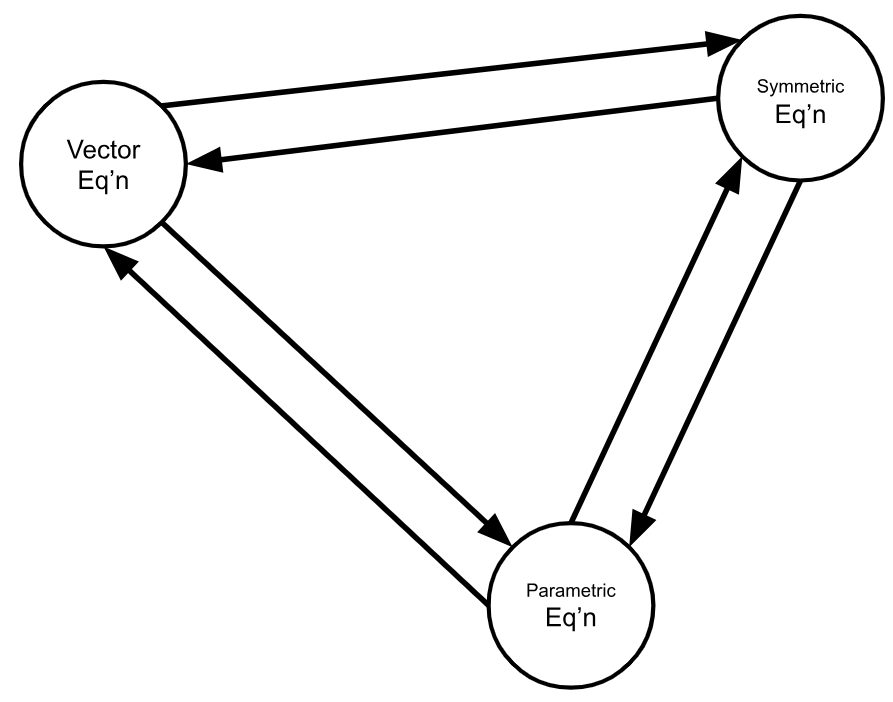
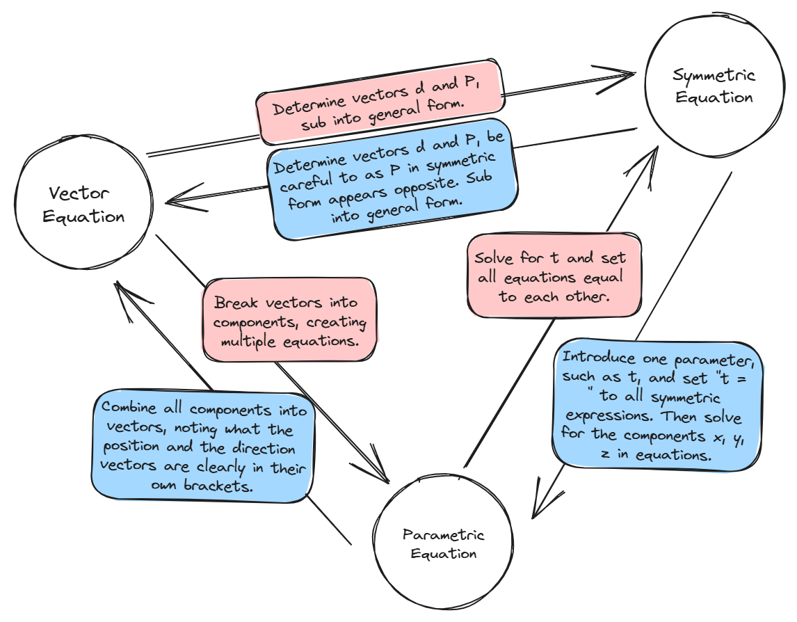
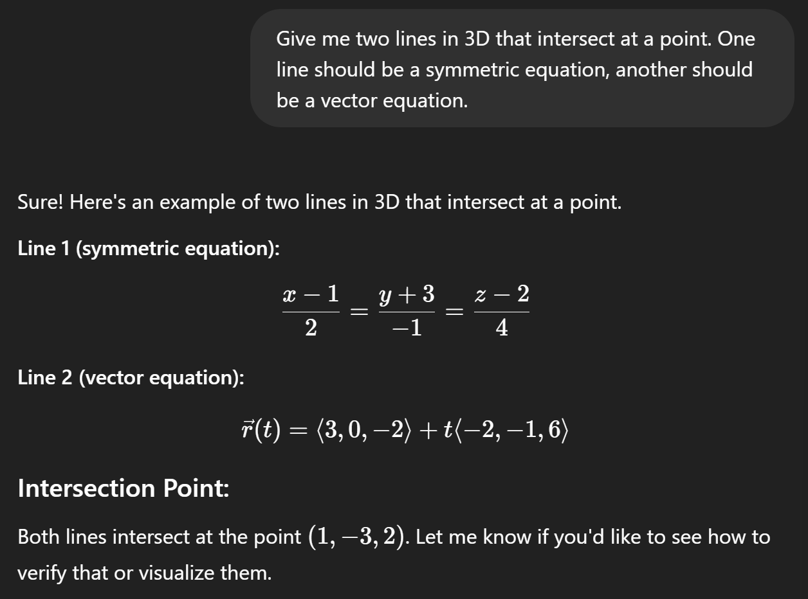

# Review Problem Set Part 1
	- Topic:  Forms of Equations in 3D
	  logseq.order-list-type:: number
		- Determine the vector, parametric, and symmetric equations of the line through the points $A(3, -1, 5)$ and $B(-4, 5, -9)$.
		  logseq.order-list-type:: number
			- *Solution*.
			  collapsed:: true
			  ---
				- Begin by finding the direction of the line, $\vec{d}$. Since the line travels between points $A$ and $B$ we reason that:
				  logseq.order-list-type:: number
				  $$\begin{align*}
				  \vec{d} &= \vec{AB} \\
				  &= \vec{B} - \vec{A} \\
				  &= \begin{bmatrix} -4 \\ 5 \\ -9 \end{bmatrix} - \begin{bmatrix} 3 \\ -1 \\ 5 \end{bmatrix} \\
				  &= \begin{bmatrix} -4 - 3 \\ 5 - (-1) \\ -9 - 5 \end{bmatrix}  \\
				  &= \begin{bmatrix} -7 \\ 6 \\ -14 \end{bmatrix} 
				  \end{align*}$$
				- The position vector $\vec{P}$ can be any point on the line, including $A$ or $B$ so without loss of generality we let $\vec{P}=A=(3,-1,5)$.
				  logseq.order-list-type:: number
				- We need a parameter, so let $t\in\R$.
				  logseq.order-list-type:: number
				- Therefore a vector equation is:
				  logseq.order-list-type:: number
				  $$\vec{v}=(3,-1,5) + t(-7,6,-14)$$
				  This solution is not ==[[unique]]==.
		- Complete this relational graph for the various forms of a line in $\R^3$ by annotating the arrows. Note:  Arrows are a short few words to describe the **process(es)** or **step(s) you perform** to go between forms in a specific direction.
		  logseq.order-list-type:: number
		  {:height 350, :width 442}
			- *Solution*.
			  collapsed:: true
			  ---
				- {:height 583, :width 728}
				  logseq.order-list-type:: number
				  <!-- [[draws/2025-05-22-15-10-22.excalidraw]] -->
		- Why is there no scalar equation for a line in $\R^3$? Hint:  {{cloze Can you draw a diagram to help you figure out and describe what problems someone would have forming a scalar equation of a line in 3D?}}
		  logseq.order-list-type:: number
			- collapsed:: true
			  *Solution*.
			  ---
				- There is not one ==[[normal]]== vector that can define a line, instead there are multiple in many different directions. This does not lend well to an equation which needs to produce points consistently on a line in a specific direction.
				  logseq.order-list-type:: number
				- From another perspective, given a normal vector, there are multiple directions a line could be defined from it, so a normal vector does not define just one line but multiple... in fact it will define a plane.
				  logseq.order-list-type:: number
					- <iframe src="https://www.desmos.com/3d/ap1wgckvrz" style="width: 100%; height: 400px"></iframe>
					  logseq.order-list-type:: number
	- Topic:  Points of Intersection in 3D
	  logseq.order-list-type:: number
		- Determine if there is a point of intersection for the following system of equations in $\R^3$. $t,k\in\R$
		  logseq.order-list-type:: number
		  $$\begin{cases} L_1: & \frac{x-1}{2}=\frac{y+3}{-1}=\frac{z-2}{4} \\ L_2: & \vec{r}(t)=\langle 3,0,-2 \rangle +t\langle -2,-1,6 \rangle \end{cases}$$
			- *Solution*.
			  logseq.order-list-type:: number
			  collapsed:: true
			  ---
				- *Fun Fact*:  I asked ChatGPT to invent a problem that had a point of intersection. It gave me this system. If I ask it to solve this system, it proves that there is no point of intersection. This just goes to show that you can't trust ChatGPT and always need to verify its results.
				  {:height 292, :width 427}
				- **Strategy**:
					- Get the value of one parameter
					- Determine the point on one line given by this parameter
					- Check if this point is also on the other line
						- If it is not on the line, there is no point of intersection.
						- If the point is on both lines, by definition it is their point of intersection.
				- Having the lines in two different forms is a tad inconvenient compared to our lesson from class but can still work for us. Let $\vec{r}(t)=\langle x,y,z \rangle$.
				  logseq.order-list-type:: number
				- Now, the parametric equations for $L_2$ are: 
				  logseq.order-list-type:: number
				  $$\begin{gather} x =3-2t \\ y =-t \\ z =-2+6t  \end{gather}$$
				  Let's substitute $(1)$ and $(2)$ into $k=\frac{x-1}{2}=\frac{y+3}{-1}$
				- We get:
				  logseq.order-list-type:: number
				  $$\frac{(3-2t)-1}{2} = \frac{(-t)+3}{-1}$$
				- Simplifying:
				  logseq.order-list-type:: number
				  $$\begin{align*}
				  \frac{3-2t-1}{2} &= \frac{-t+3}{-1} \\
				  \frac{2-2t}{2} &= t-3 \\
				  1-t &= t-3 \\
				  1+3 &= t+t \\
				  4 &= 2t \\
				  \frac{4}{2} &= t \\
				  2 &= t 
				  \end{align*}$$
				- Let's use $t=2$ to get what we believe is our Point of Intersection:
				  logseq.order-list-type:: number
				  $$\begin{align*}
				  \vec{r}(t) &=\langle 3,0,-2 \rangle +t\langle -2,-1,6 \rangle \\
				  \vec{r}(2) &=\langle 3,0,-2 \rangle +(2)\langle -2,-1,6 \rangle \\ 
				  &=\langle 3-4,-2,-2+12 \rangle \\
				  &=\langle -1,-2,10 \rangle 
				  \end{align*}$$
				- Since we found this point using $L_1$, now we need to check that this point also satisfies $L_2$. If there is no point of intersection, this check will fail.
				  logseq.order-list-type:: number
				  $$\begin{gather*}
				  \frac{x-1}{2}=\frac{y+2}{-1}=\frac{z-2}{4} \\
				  \frac{-1-1}{2}=\frac{-2+2}{-1}=\frac{10-2}{4} \\
				  \frac{-2}{2}=\frac{0}{-1}=\frac{8}{4} \\
				  \frac{-2}{2}\not=\frac{0}{-1}\not=\frac{8}{4} 
				  \end{gather*}$$
				  The symmetric expressions are not equal, so the check has failed.
				- Therefore, this system has no point of intersection. (In fact, it is skew, but this fact was not asked by the question)
				  logseq.order-list-type:: number
				- logseq.order-list-type:: number
		- In his handout, Mr. Cluchey messed up and wrote $\langle -2,-1,-6 \rangle$, introducing an extra negative. Does this new, erroneous system still have a point of intersection or is it skew?
		  logseq.order-list-type:: number
			- *Solution*.
			  collapsed:: true
			  ---
				- No, there will not be a point of intersection. In the solution to part a, we found $t=2$ by using only the $x$ and $y$ components. We would follow the same strategy in this problem which means we'd get the same $t=2$ parameter for the potential point of intersection.
				  logseq.order-list-type:: number
				- Except, it still doesn't work since we would then have $\langle -1,-2,-8 \rangle$, where $x=-1$ and $y=-2$ will still not satisfy the symmetric equation.
				  logseq.order-list-type:: number
		- Determine the point of intersection for the following system of equations in $\R^3$. $t,k\in\R$
		  logseq.order-list-type:: number
		  $$\begin{cases} L_3: & \{ x=1-k, 2y=k+1, z=2-2k \} \\ L_4: & \langle \frac{1}{2},\frac{3}{4},1 \rangle +t\langle 2,-1,4 \rangle \end{cases}$$
			- *Solution*.
			  collapsed:: true
			  ---
				- One should always check if the lines are parallel first. In fact these are:
				  logseq.order-list-type:: number
				  $$L_3:  \begin{cases} x=1-k \\ y = \frac{1}{2}+\frac{1}{2}k \\z = 2-2k \end{cases}$$
				  Where the direction vector is
				  $$\langle -1,\frac{1}{2},-2 \rangle = \left(-\frac{1}{2}\right)\langle 2,-1,4 \rangle$$
				  is a scalar multiple of $L_4$'s direction vector.
				- Hence, $L_3$ and $L_4$ are parallel. Now we are not looking for a Point of Intersection anymore, instead, we want to tell if the lines are coincident or just parallel.
				  logseq.order-list-type:: number
				- **Strategy**:
				  logseq.order-list-type:: number
					- If the lines are coincident, they will share all points. Since we know they are parallel already, we can check if one of the position vectors is on the other line. If we find that, yes, it is, then the lines must be coincident.
					  logseq.order-list-type:: number
					- If that check fails, they must be parallel (not skew).
					  logseq.order-list-type:: number
				- Let's see if $\langle 1, 1, 2 \rangle$ is on $L_4$:
				  logseq.order-list-type:: number
				  $$\langle 1, 1, 2 \rangle = \langle\frac{1}{2},\frac{3}{4},1 \rangle +t\langle 2,-1,4 \rangle$$
				  By ==[[inspection]]==, we will notice that $t=\frac{1}{4}$ will get the point $(1,1,2)$ out of $L_4$.
				- Therefore, these lines are coincident.
				  logseq.order-list-type:: number
				  ---
		- **New!** Determine the point of intersection for the following system of equations in $\R^3$. **This system actually has a point of intersection**. $t,k\in\R$
		  logseq.order-list-type:: number
		  $$L_5:  \begin{cases} x=3+k \\ y=-7-2k \\ z=5+4k \end{cases} \text{ and } L_6:  \begin{cases} x=-7+3t \\ y=-8+t \\ z=4-t \end{cases}$$
			- collapsed:: true
			  *Solution*.
			  ---
				- Let's first notice that the direction vectors are not scalar multiples of one another, so this system is not parallel or coincident.
				  logseq.order-list-type:: number
				- Set $x$, $y$, and $z$ equal to each other.
				  logseq.order-list-type:: number
				  $$\begin{align}
				  3 + k &= −7 + 3t \\
				  −7 − 2k &= −8 + t \\
				  5 + 4k &= 4 − t
				  \end{align}$$
				- Add (2)+(3):
				  logseq.order-list-type:: number
				  $$\begin{align*}
				  − 2 + 2k &= −4 \\
				  k &= −1
				  \end{align*}$$
				- Substitute $k=-1$ into (2):
				  logseq.order-list-type:: number
				  $$\begin{align*}
				  − 7 − 2(−1) &= −8 + t \\
				  t &= 3
				  \end{align*}$$
				- Let's use $k = -1$ and $t=3$ to get the point of intersection from both $L_5$ and $L_6$. If they points match, then this system is not skew.
				  logseq.order-list-type:: number
				  $$L_5:  \begin{cases} x &=3-1 &= 2 \\ y &=-7-2(-1) &= -5 \\ z &=5+4(-1) &=1 \end{cases} $$
				  $$L_6:  \begin{cases} x&=-7+3(3)&=2 \\ y&=-8+(3)&=-5 \\ z&=4-(3)&=1 \end{cases}$$
				- Therefore, the point of intersection of these lines is $(2,-5,1)$.
				  logseq.order-list-type:: number
	- Topic:  Making decisions with an ambiguous problem.
	  logseq.order-list-type:: number
		- Find the intersection (if any) of the following two lines in $\R^3$, if they do not intersect, state whether they are skew or parallel. $t,k\in\R$
		  logseq.order-list-type:: number
		  $$\begin{cases} \langle x,y,z \rangle = \langle 2,14,1 \rangle +t\langle -1,-1,1 \rangle \\ \langle x,y,z \rangle=\langle 3,-3,0 \rangle +t\langle -1,2,5 \rangle \end{cases}$$
		- Create a ==[[flowchart]]== to explain the steps you should take to efficiently write down the solution to \#3a. Hint: {{cloze The first step in your flowchart should be "Check if the two lines are parallel".  Why is this the suggested first step and how do you check?}}
		  logseq.order-list-type:: number
		- *No solutions given*. This problem is extra practice. Compare to your classmates.
		- ---
	- Find the vector equation of a line parallel to $7-x=\frac{y+5}{3}=\frac{z+26}{2}$ and passing through the point $(1,-2,9)$.
	  logseq.order-list-type:: number
		- collapsed:: true
		  *Solution*.
			- The direction vector is the denominators, so $\vec{d}=(1,3,2)$. A line parallel to this has the same direction.
			  logseq.order-list-type:: number
			- $\vec{P}=(1,-2,9)$.
			  logseq.order-list-type:: number
			- Therefore, $\vec{v}=(1,-2,9) + t(1,3,2)$ for $t\in\R$.
			  logseq.order-list-type:: number
		- ---
	- Thinking & Application
	  logseq.order-list-type:: number
		- What do we know about the coordinates of every vector located on the xz-plane?
		  logseq.order-list-type:: number
			- *Solution*.
			  collapsed:: true
			  ---
				- We know the y-coordinate is $0$. I.e. every vector looks like $(\#, 0, \#)$.
				  logseq.order-list-type:: number
		- Find the equation of the line which has a direction vector perpendicular to the xy-plane and passing through the origin. This line has another name, what is it?
		  logseq.order-list-type:: number
			- *Solution*.
			  collapsed:: true
			  ---
				- A vector perpendicular to the xy-plane is $(0,0,1)$ and if this line passes through $(0,0,0)$ then we know the equation is, for $t\in\R$:
				  logseq.order-list-type:: number
				  $$(x,y,z)=t(0,0,1)$$
				- This line has the name "z-axis".
				  logseq.order-list-type:: number
		- Suppose A is on line 1 and B is on line 2. Find the coordinates of A and B such that $\vec{AB}$ is perpendicular to both lines. $t,k\in\R$
		  logseq.order-list-type:: number
		  $$\begin{cases} L_1: & \langle x,y,z \rangle = \langle 0,17,-10 \rangle +k\langle 2,0,1 \rangle \\ L_2: & \langle x,y,z \rangle =\langle 13,30,19 \rangle +t\langle 5,6,5 \rangle \end{cases}$$
			- *Solution*.
			  collapsed:: true
			  ---
				- **Strategy**:
					- This is a complicated one, let's break it down.
					- If you made A a vector, what would it need to look like? What does every vector on $L_1$ look like? Use parameters to get a formula for the vector A.
					- Do the same for vector B.
					- Now get the vector $\vec{AB}$ from these formulas. It should be a rather large vector with multiple variables making up its components.
					- This vector needs to be perpendicular to two known vectors. You see the word perpendicular which should cue up either:  dot product or cross product.
						- When it comes to solving unknowns, use the dot product.
						- The cross product is better for situations in which you need to create a vector which is perpendicular.
					- Dot product your large formula based vector with each direction vector. You will get two equations in two variables, $t,k$, from doing this. Solve for both $t$ and $k$ with this system and then you can get points A and B from $t$ and $k$ using earlier formulas.