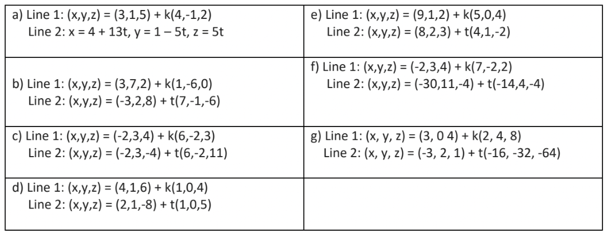

alias:: MCV4U 5-3, CV5-3

- # This is getting out of hand! Now, there are two of them! #.v-border-children
	- Let's imagine what happens when we have two lines graphed in 2D and 3D. What do you remember from Grade 9 and 10 about the ==[[point of intersection]]==?
	- ## Warm Up
		- Imagine two lines in 2D. How many *different* ways can the two lines interact? Sketch all possible interactions.
		  id:: 682dbd01-3f81-4b46-9569-8fc7470c859f
		  [Solution]([[MCV4U 5-3 Solutions]]): {{cloze There are technically three ways:  Parallel (no POI), Coincident (parallel with an infinite number of POI as the lines are on top of each other), and Intersecting at just one point. It is not possible for two lines to intersect at two or more finite number of points.}}
		  @@html:    @@
		- Now imagine two lines in 3D. How many *different* ways can two lines interact in 3D? Sketch all possible interactions.
		  Solution: {{cloze There are now four ways to interact:  Parallel (no POI), Coincident (Infinite POI), Skew (not Parallel and no POI), and Intersecting at one point. It is not possible for 3D lines to intersect in two or more finite number of points.}}
		  @@html:    @@
		- In Grade 9 and 10, what was your strategy to calculate the Point of Intersection for a system of linear equations such as $$\begin{cases} y = 3x+4 \\ y = \frac{1}{4}x-3 \end{cases}$$ 
		  Solution: {{cloze You probably used Substitution or Elimination. We will use these methods again today.}}
		  @@html:    @@
	- ## Action
		- a) Find the intersection point of the lines in 2D, where $$t,k\in\R$$,
		  logseq.order-list-type:: number
		  $$\begin{bmatrix} x \\ y \end{bmatrix} = \begin{bmatrix} 11 \\ -2 \end{bmatrix} + t \begin{bmatrix} 3 \\ -2 \end{bmatrix}$$
		  $$\begin{bmatrix} x \\ y \end{bmatrix} = \begin{bmatrix} -5 \\ 4 \end{bmatrix} + k \begin{bmatrix} 2 \\ 1 \end{bmatrix} $$
		  Solution: {{cloze Using the method of substitution we can get two equations in two unknowns. Then solve for t and k using elimination (preferred method) or substitution. Isolate for t and k. Once we have t and k, we substitute them into one vector equation to get the point. We can check our work by substituting t and k into the second equation and we should get the same point.}}
		  @@html:    @@
		  
		  b) What method did you use to solve this problem? How is your method similar to a method learned in Grade 9 or 10?
		  Solution: {{cloze We need Substitution to begin, getting us a system of two equations in two unknowns. Then we apply Elimination (preferred) to isolate for t and k.}}
		  @@html:    @@
		- Determine whether the following lines ==[intersect]([[intersection]])==; if they do not intersect, state whether you think they are ==[[parallel]]== or ==[[skew]]==. Let $$t, k \in\R$$
		  logseq.order-list-type:: number
		  $$\begin{cases} x=-1+3t \\ y=1+4t \\ z=-2t \end{cases}$$
		  $$\begin{cases} x=-1+2k \\ y=3-k \\ z=-8+k \end{cases}$$
		  Solution: {{cloze This system, using substitution, gives us more than enough equations to get t and k. If we use the third equation, our t and k must work for it. If they do not, it means our system has no POI. If the system has no POI, to decide if the lines are parallel, determine if one direction vector is a multiple of the other direction vector. If not, then these lines are skew.}}
		  @@html:    @@
	- ## Consolidation
		- Create the vector or parametric equations for two parallel, but not ==[[coincident]]==, lines in $$\R^3$$. If you try to solve this system for its ==[parameters]([[parameter]])==, what happens? Will this always happen for two parallel lines?
		  logseq.order-list-type:: number
		- Create the vector or parametric equations for two coincident lines in $$\R^3$$. If you try to solve this system for its parameters, what happens? Will this always happen for two coincident lines?
		  logseq.order-list-type:: number
		- Create the vector or parametric equations for two ==[[skew]]== lines in $$\R^3$$. If you try to solve this system for its parameters, what happens? Will this always happen for two skew lines?
		  logseq.order-list-type:: number
		- How can you verify that your solution to a system of equations is correct?
		  logseq.order-list-type:: number
		- ### Practice
			- Find the intersection between each line. If the lines do not intersect, state whether the lines are parallel or skew. In each equations, assume $$t,k\in\R$$.
			  logseq.order-list-type:: number
			  
			  Answers to Check:  {{cloze 1a) Skew. b) (4, 1, 2). c) (4, 1, 7). d) (8, 1, 22). e) Skew. f) Coincident, infinite intersection points. g) Parallel. }}
	- ## Review Flashcards
		- Return to [[CV5]] to review these flashcards.
		- #card How do you know two lines are skew while solving their system of equations? #[[MCV4U]] #CV5
			- Solved parameters will not be equal, you may find $$t=1$$ in one solution and $$t=-3$$ in another.
			- The direction vectors of the lines are not ==[[parallel]]==.
		- #card How can you tell if two lines are parallel? #[[MCV4U]] #[[CV5]]
			- Their direction vectors are scalar multiples. #eg $$(2,1)=\frac{1}{2}(4, 2)$$ which means the lines $$\vec{v}=(2,1)t+(1,1)$$ and $$\vec{v}=(4,2)k+(-6,7)$$, $$t,k\in\R$$ are ==[[parallel]]==.