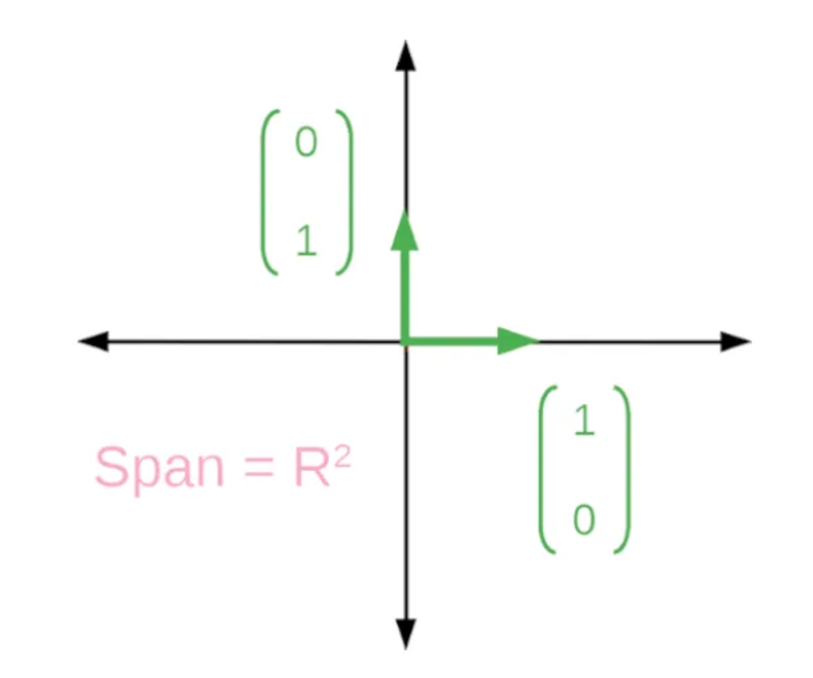
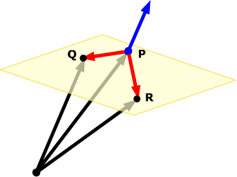

# 3, 2, 1, Take off
	- >> Today our **goal** is to describe how to plot a plane in $\mathbb{R}^3$ using vector and parametric equations.
- ## Forced Recall #.v-self-border
	- Find a vector, $\vec{w}$, which is perpendicular to both $\vec{v}={}\begin{bmatrix}-5\\ 1\\ -5\end{bmatrix}$ and $\vec{u}={}\begin{bmatrix}1\\ 3\\ 11\end{bmatrix}$.
	  logseq.order-list-type:: number
		- *Solution.*
		  logseq.order-list-type:: number
			- We use the ==[[cross product]]==: $\vec{u}\times \vec{v}$.
			  logseq.order-list-type:: number
			- logseq.order-list-type:: number
			  $$\begin{matrix}
			  \cancel{-5} & 1 & -5 & -5 & 1 & \cancel{-5} \\
			  \cancel{1} & 3 & 11 & 1 & 3 & \cancel{11}
			  \end{matrix}$$
			- Then a perpendicular vector would be:
			  logseq.order-list-type:: number
			- logseq.order-list-type:: number
			  $$
			  \begin{bmatrix} 
			  1(11) - (-5)(3) \\ -5(1) - (-5)(11) \\ -5(3)-(1)(1) \end{bmatrix} 
			  = \begin{bmatrix} 
			  26 \\ 50 \\ -16 
			  \end{bmatrix}$$
			- Since this vector has large numbers, we will find a shorter, parallel vector:  Let
			  logseq.order-list-type:: number
			- logseq.order-list-type:: number
			  $$\vec{w} = \frac12\begin{bmatrix}26\\ 50\\ -16\end{bmatrix}=\begin{bmatrix}13\\ 25\\ -8\end{bmatrix}$$
	- Prove $\vec{w}$ is perpendicular to $\vec{v}$ and $\vec{u}$ by showing that $w\cdot u=0=w\cdot v$.
	  logseq.order-list-type:: number
		- *Solution.*
		  logseq.order-list-type:: number
		  collapsed:: true
			- logseq.order-list-type:: number
			  $$\begin{align*}
			  & \begin{bmatrix}
			  13\\ 25\\ -8
			  \end{bmatrix}
			  \cdot\begin{bmatrix}
			  -5\\ 1\\ -5
			  \end{bmatrix} \\
			  =& 13\left(-5\right)+25\left(1\right)+\left(-8\right)\left(-5\right) \\
			  =& -65+25+40 \\
			  =& 0
			  \end{align*}$$
			- logseq.order-list-type:: number
			  $$\begin{align*}
			  & \begin{bmatrix}
			  13\\ 25\\ -8
			  \end{bmatrix}
			  \cdot\begin{bmatrix}
			  1\\ 3\\ 11
			  \end{bmatrix} \\
			  =& 13\left(1\right)+25\left(3\right)+\left(-8\right)\left(11\right) \\
			  =& 13+75-88 \\
			  =& 0
			  \end{align*}$$
			- It's like magic!
			  logseq.order-list-type:: number
- ## Action #.v-self-border
	- ### Example 1.
		- Find vector and parametric equations of the plane with points $A(2,4,-2)$, $B(3,7,9)$, and $C(-2,8,4)$. What is going on here? Draw a diagram. Why can a diagram help solve this problem?
			- **Strategy.**
			  collapsed:: true
				- A plane is a flat surface. We are familiar with one plane very well, the ==[Cartesian plane]([[Cartesian]])==. How many vectors are needed to find any point on this plane?
				- You need two! An $\hat{x}=(1,0)$ and a $\hat{y}=(0,1)$. Using this scale, we can make any point on the plane.
				- In fact, we can use any scale like this. We could take $\hat{x}=(3,0)$ and a $\hat{y}=(0,\frac17)$. This wouldn't be as convenient for integer points but we could make it work.
				- So the xy-plane has equation $(x,y)=t(1,0)+k(0,1)$ for $t,k\in\R$.
				- Let's use two vectors in the same way but without being restricted to the x and y axis.
				- {:height 324, :width 376}
					- Source:  #cite #later https://medium.com/@joshua.wheeler/introduction-to-linear-algebra-with-applications-to-machine-learning-image-compression-f5de08f120df
			- *Solution.*
			  collapsed:: true
				- 
				  logseq.order-list-type:: number
					- Imagine this had points A, B, C instead of Q, P, R.
					  logseq.order-list-type:: number
					- Source:  #cite #LATER https://thejuniverse.org/PUBLIC/LinearAlgebra/LOLA/planes/find.html
					  logseq.order-list-type:: number
				- First we find vectors $\vec{AB}$ and $\vec{BC}$. These will be our "scale" or, as we will call them now, our two ==[direction vectors]([[direction vector]])==. In future courses, you will call these vectors your [[basis]].
				  logseq.order-list-type:: number
				- By ==[[inspection]]==, $\vec{AB} = (1,3,11)$ and $\vec{BC} = (-5, 1, -5)$.
				  logseq.order-list-type:: number
				- Let $t,k\in\R$. Then our plane may be represented by:
				  logseq.order-list-type:: number
				- logseq.order-list-type:: number
				  $$\begin{bmatrix}2\\ 4\\ -2\end{bmatrix}+t\begin{bmatrix}1\\ 3\\ 11\end{bmatrix}+k\begin{bmatrix}-5\\ 1\\ -5\end{bmatrix}$$
				- With parametric equations:
				  logseq.order-list-type:: number
				- logseq.order-list-type:: number
				  $$\begin{cases}
				  x &= 2 + t -5k \\
				  y &= 4 + 3t + k \\
				  z &= -2 + 11t -5k
				  \end{cases}$$
	- ### Example 2.
		- Find the vector and parametric equations of the plane that is perpendicular to the plane
			- $$\begin{bmatrix}x\\ y\\ z\end{bmatrix}=\begin{bmatrix}1\\ 2\\ 3\end{bmatrix}+t\begin{bmatrix}-2\\ 4\\ 6\end{bmatrix}+k\begin{bmatrix}1\\ 3\\ -4\end{bmatrix}$$
			- and contains the line
			- $$\begin{bmatrix}x\\ y\\ z\end{bmatrix}=\begin{bmatrix}-3\\ 4\\ 6\end{bmatrix}+q\begin{bmatrix}1\\ 0\\ 2\end{bmatrix}$$
			- for $t,k,q\in\R$. Draw the *roughest* diagram of this situation.
			- **Strategy.**
			  collapsed:: true
				- Find the cross product of the two direction vectors of the plane provided. This gives a direction which is perpendicular to the plane provided.
				  logseq.order-list-type:: number
				- If we need to contain the line, the position vector and the direction must both be on our new plane.
				  logseq.order-list-type:: number
				- Counting what we have, you can see we have two directions and one position. This is all we need to define the plane.
				  logseq.order-list-type:: number
			- *Solution.* #LATER
			  collapsed:: true
				- Cross product:
				- Position and second direction:
				- Vector Equation:
				- Parametric Equations:
- ## Consolidation #.v-self-border
	- Explain the different parts of the vector equations of a plane:  $\vec{v}=\vec{P}+t\vec{u}+k\vec{w}$, $t,k\in\R$.
	- Practice #later
		- Decide whether each equation would make a line or a plane. Use $t,k\in\R$ for all parts.
		  logseq.order-list-type:: number
		- Find the vector equation of a plane that contains the points $A(1,2,3)$, $B(-3, 4, 5)$, and $C(-4,5,2)$.
		  logseq.order-list-type:: number
		- logseq.order-list-type:: number