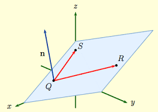

- #+BEGIN_WARNING
  In this lesson our **goal** is to describe a plane with a scalar equation, i.e. an equation without vectors. We will learn to use Desmos 3D to represent 
  #+END_WARNING
- ## Recall
	- Given the scalar equation in 2D for a line, what is the normal vector?
		- Use $Ax+By+C=0$ or, #eg $3x-5y-1=0$.
			- **Recall:**
			  collapsed:: true
				- A normal is a vector that is perpendicular to the direction of the line.
				- Given $Ax+By+C=0$ we can get the normal vector by reading off $A$ and $B$. I.e. the normal vector is $\begin{bmatrix}A\\ B\end{bmatrix}$.
				- In the example above, a normal vector is $\begin{bmatrix}3\\ -5\end{bmatrix}$
- ## Lesson
	- The scalar equation of a plane is similar to the one for a line, but has an extra parameter:
		- $$Ax+By+Cz+D=0$$
		- Where $\begin{bmatrix}A\\ B\\ C\end{bmatrix}$ is a normal vector to the plane depicted as $n$ in the diagram below where $S$ and $R$ are direction vectors in the plane.
		- 
		- Note that our idea that a normal vector is perpendicular to the direction(s) still holds true. Our $n$ is perpendicular to **both** $S$ and $R$.
- ## Action
	- Examples
	  logseq.order-list-type:: number
		- Find the scalar equation of the plane, $t,k\in\R$:
		  logseq.order-list-type:: number
		  collapsed:: true
		  $$\begin{bmatrix}x\\ y\\ z\end{bmatrix}=\begin{bmatrix}1\\ 2\\ 3\end{bmatrix}+t\begin{bmatrix}-2\\ 4\\ 6\end{bmatrix}+k\begin{bmatrix}1\\ 3\\ -4\end{bmatrix}$$
			- **Strategy:**
			  logseq.order-list-type:: number
				- We need a vector perpendicular to both direction vectors. We need the **cross product**!
				  logseq.order-list-type:: number
				  collapsed:: true
					- logseq.order-list-type:: number
					  $$\begin{matrix}\cancel{-2} & 4 & 6 & -2 & 4 & \cancel{6}\\ \cancel{1} & 3 & -4 & 1 & 3 & \cancel{-4}\end{matrix}$$
					- So then
					  logseq.order-list-type:: number
					  $$\begin{align*}&=\begin{bmatrix}
					  4\left(-4\right)-3\left(6\right)\\ 6\left(1\right)-\left(-2\right)\left(-4\right)\\ -2\left(3\right)-4\left(1\right)
					  \end{bmatrix} \\
					  &= \begin{bmatrix}
					  -32 \\ 14 \\ -10
					  \end{bmatrix} \\
					  &= -\frac12 \begin{bmatrix}
					  16 \\ -7 \\ 5
					  \end{bmatrix}
					  \end{align*}$$
					- And we'll let $\vec{n}=\begin{bmatrix}16\\ -7\\ 5\end{bmatrix}$
					  logseq.order-list-type:: number
				- Therefore the scalar equation is (so far):
				  logseq.order-list-type:: number
				  collapsed:: true
					- $16x-7y+5+D=0$
					  logseq.order-list-type:: number
				- Substituting $(1,2,3)$ to solve for $D$:
				  logseq.order-list-type:: number
				  collapsed:: true
					- $16(1)-7(2)+5(3)=-D$
					  logseq.order-list-type:: number
					- logseq.order-list-type:: number
					  $$\begin{align*}16-14+15 &= -D \\ 16+1 &= \\ 17 &=-D\end{align*}$$
					- Therefore, $D=-17$
					  logseq.order-list-type:: number
				- Therefore, the scalar equation is $16x-7y+5-17=0$
				  logseq.order-list-type:: number
		- Show that the point represented by $t=4$ and $k=-3$ is in fact also on the scalar equation you found.
		  logseq.order-list-type:: number
			- **Strategy:**
			  logseq.order-list-type:: number
				- Get the point defined by $t=4$ and $k=-3$.
				  logseq.order-list-type:: number
					- logseq.order-list-type:: number
					  $$\begin{align*}
					  \begin{bmatrix}x\\ y\\ z\end{bmatrix}&=\begin{bmatrix}1\\ 2\\ 3\end{bmatrix}+4\begin{bmatrix}-2\\ 4\\ 6\end{bmatrix}-3\begin{bmatrix}1\\ 3\\ -4\end{bmatrix}
					  &= \begin{bmatrix}
					  1 -8 -3 \\ 2 + 16 -9 \\ 3 + 24 +12
					  \end{bmatrix}
					  &= \begin{bmatrix}
					  -10 \\  9 \\ 39
					  \end{bmatrix}
					  \end{align*}$$
					- logseq.order-list-type:: number
	- Find the scalar equation of the plane that contains the points $(1,4,5)$ and $(3, 2, 1)$ and is perpendicular to $2x-y+z-10=0$.
	  logseq.order-list-type:: number
- ## Consolidation
	- What information is needed to create a scalar equation of a plane?
	- What are the steps to use a vector equation of a plane to get the scalar equation?