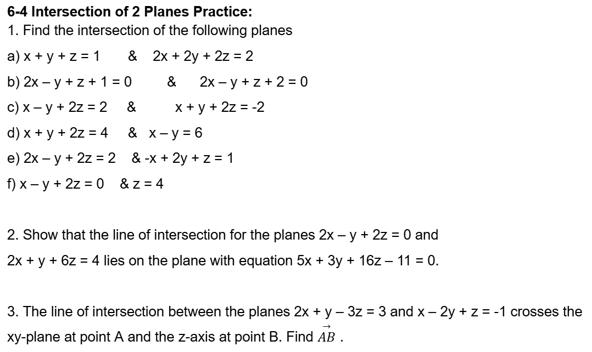
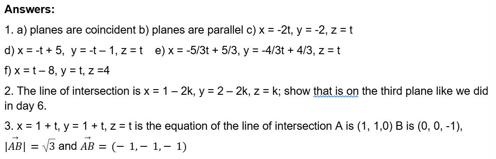

- #+BEGIN_CAUTION
  By the end of this lesson, you will solve a system of equations where the solution is a line.
  #+END_CAUTION
- ## Forced Recall
	- In what ways can two lines interact in 2D?
	- How have we ==[generalized]([[generalize]])== this idea to 3D so far? Write down everything you know about the ways lines and planes interact in 3D space.
	- What are all the ways **two** planes can interact? What would you expect to find as their intersection?
- ## Action:  Examples
	- Find the intersection (if any) of the planes:
	  logseq.order-list-type:: number
		- $3x-2y+z-7=0$
		  logseq.order-list-type:: number
		- $2x+4y-2z+12=0$
		  logseq.order-list-type:: number
	- Find the intersection (if any) of the planes:
	  logseq.order-list-type:: number
		- $x+4y-3z+6=0$
		  logseq.order-list-type:: number
		- $2x+8y-6z+11=0$
		  logseq.order-list-type:: number
- ## Consolidation
	- What are the allowed operations when using elimination? There are **three** but the last is very subtle.
	  collapsed:: true
		- Multiply an equation by a constant.
		  logseq.order-list-type:: number
		- Add or subtract two different equations. Each equation in a system is still itself, even after multiplied by a constant, so don't mix up equations by [thinking a multiple of one is a distinct equation in your system](((683d14e7-506f-43a0-ba8e-ba6bb9b31956))).
		  logseq.order-list-type:: number
		- Swap the order of equations.
		  logseq.order-list-type:: number
	- Practice:
		- {:height 269, :width 452}
		  collapsed:: true
			- {:height 144, :width 432}