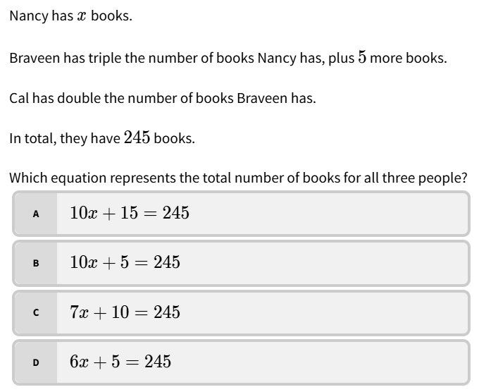
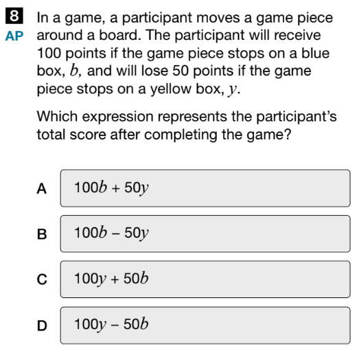
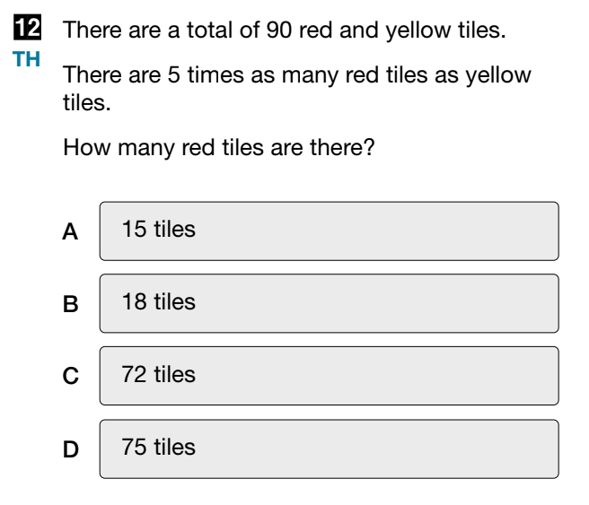
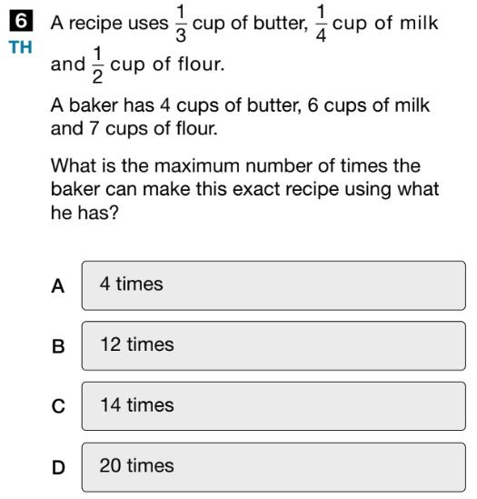

- #+BEGIN_WARNING
  Our **goal** this lesson is to learn how to create general mathematical models from words.
  #+END_WARNING
- ## Warm Up
	- Let's think about how to translate some English into Algebra, here's an example from EQAO:
		- {:height 294, :width 343}
		- *Solution.*
		  collapsed:: true
			- By giving Nancy $x$ books, we can discuss Nancy's amount without knowing the number. Let's analyze the next sentences:
			- Braveen has triple the number of books Nancy has, plus 5 more books.
			  collapsed:: true
				- $3x+5$ or $3(x+5)$?
				  collapsed:: true
					- *Answer* is $3x+5$ since the 5 more books is added after the tripling.
			- Cal has double the number of books Braveen has.
			  collapsed:: true
				- If Braveen has $3x+5$ what is double?
				  collapsed:: true
					- $2(3x+5)$ or $(2)3x+5$?
					  collapsed:: true
						- *Answer.* $2(3x+5)=6x+10$ because we need to double the entire amount of books. The brackets $(\square)$ group Braveen's together into one number we need to calculate first.
			- In total they have 245 books:
			  collapsed:: true
				- Nancy + Braveen + Cal = 245
				  collapsed:: true
					- $x + (3x+5) + 2(3x+5) = 245$
					  collapsed:: true
					  now solve for x.
						- *Answer.* $x=23$
	- Complete this next one on your own.
		- Cooper has a weirdly large number of tooth brushes.
			- If we add 5 more to Cooper's amount and then double it, we get the size of Finn's significantly larger collection of tooth brushes.
				- Even more impressive is Lucas's collection which is ten times larger minus one tooth brush, which he recently lost in a freak tooth whitening incident.
		- If together, Cooper, Finn, and Lucas have  How many tooth brushes does Cooper have?
	- And here's a question from EQAO in 2024:
		- {:height 287, :width 278}
- ## Action
	- This is a question from #EQAO in 2023:
		- {:height 250, :width 285}
	- 
	-
- ## Consolidation
-