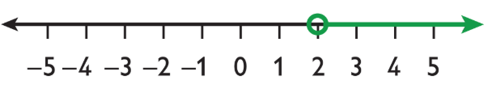
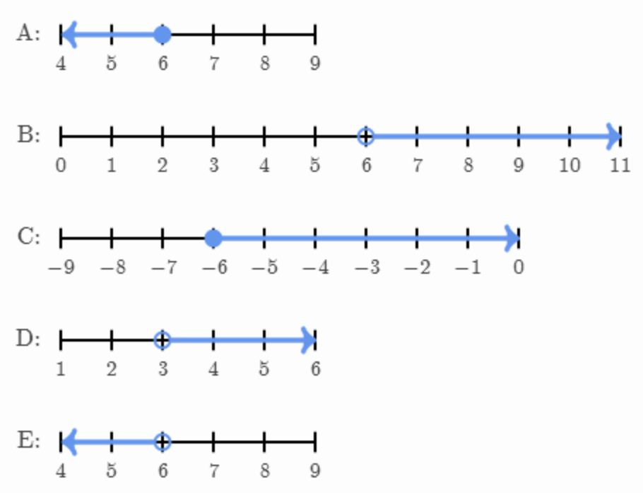

- #+BEGIN_CAUTION
  Today we will learn to describe inequalities using our knowledge of Linear Relations to further model interesting objects on graphs.
  #+END_CAUTION
- ## Preparing for EQAO #.v-self-border
	- Here is a question posed on an #EQAO practice test. What do you understand about it? What do you notice that is *familiar*? What do you notice that is *not familiar*?
		- Which inequality corresponds to this graph? #.v-border-children 
		  logseq.order-list-type:: number
		  {:height 364, :width 382}
			- $2x-y\leq-2$
			  logseq.order-list-type:: number
			- $2x+y\le-2$
			  logseq.order-list-type:: number
			- $x-2y\le-2$
			  logseq.order-list-type:: number
			- $x+2y\le-2$
			  logseq.order-list-type:: number
- ## Warm Up #.v-self-border-children
	- An ==[[inequality]]== is a `True` or `False` statement using numbers.
		- Examples: Which of the following statements are `True`?
			- $3>4$
			- $4<3$
			- $3<4$
			- $3\leq3$
			- $3<3$
			- $3\leq-3$
			- $-3<3$
	- When we introduce variables, we begin asking questions where the answers are `True` or `False` Here is an example, **can you make up new questions to match** the ==[[subsequent]]== inequalities?
		- #eg $x<3$ is like the question:
			- "What numbers are less than 3?"
			- The answer $x=2$ is `True` while $x=4$ would `False`.
				- We can substitute to check:  $2<3$ is `True` and $4<2$ is `False`
		- $y>10$ - The Question you make:  "What numbers are \_\_\_\_ than \_\_\_\_?"
		- $n<-3$
		- $k>-5$
	- We can also match these questions to our number line. Here is an example, **can you draw number lines for the rest?**
		- #eg An open circle means it does not equal 2. So $x>2$ has this picture:
		  
		- $y\geq10$
		- $n<-3$
		- $k\geq-5$
		- Can you work backwards from the number line to write the inequality?
			- {:height 415, :width 551}
- ## Lesson #.v-self-border-children
	- We want to learn about these types of inequalities:
		- $y>2x+3$
		- **Strategy:** Graph the line $y=2x+3$ using [Desmos](https://desmos.com/calculator)
		  collapsed:: true
			- <iframe src = "https://www.desmos.com/calculator/4brddn7vio" style="height: 400px; width: 100%" ></iframe>
		- We can ask the question, like in the warm up, "What are the y-values greater than the line $2x+3$? Can you identify the ==[[region]]== of the graph this question is creating?
			- *Open this section to see the Solution.*
			  collapsed:: true
				- <iframe src = "https://www.desmos.com/calculator/f01d8fn3hi" style="height: 400px; width: 100%" ></iframe>
	- ### Watch this Video
		- <iframe width="560" height="420" src="https://www.youtube.com/embed/P_-c9D6mjGA?si=93BnTj_s2tu_Dwie" title="YouTube video player" frameborder="0" allow="accelerometer; autoplay; clipboard-write; encrypted-media; gyroscope; picture-in-picture; web-share" referrerpolicy="strict-origin-when-cross-origin" allowfullscreen></iframe>
		- We can guess points to eliminate answers to the EQAO problem. We can try points inside the region, on the line, and outside the region. When we say "try points" we mean we will substitute the point into the first possible answer $2x-y\leq-2$ and every other answer.
			- {:height 364, :width 382}
			- Find **two** points and answer the question:
				- Find a point inside the region on this graph that makes $2x-y\leq-2$ `False`. This proves option A is not the answer to the EQAO problem.
				  logseq.order-list-type:: number
				- Find a point inside the region on this graph that makes $2x-y\leq-2$ `True`. Does this prove that option A is the correct answer to the EQAO problem?
				  logseq.order-list-type:: number
				- Why do we need to check a few points in each inequality option to solve this EQAO question?
				  logseq.order-list-type:: number
	- ***Exit Ticket:***
		- Draw the region of the graph defined by $y<4x-5$.
		- Determine **two** points, one inside the region of the graph defined by $-4x-2y>6$ and one outside of the region.
- ## Practice #.v-self-border
	- For each inequality, is the region *above the line* or *below the line* shaded? Check your answers using [Desmos](https://desmos.com/calculator).
	  logseq.order-list-type:: number
		- $y>3x+4$
		  logseq.order-list-type:: number
		- $4x-3<y$
		  logseq.order-list-type:: number
		- $y< -3x-1$
		  logseq.order-list-type:: number
		- $\frac15 x-2 > y$
		  logseq.order-list-type:: number
	- Are the graphs of $y>3x+4$ and $3x+4>y$ the same? How can you know from the inequalities before you use Desmos?
	  logseq.order-list-type:: number
	- logseq.order-list-type:: number