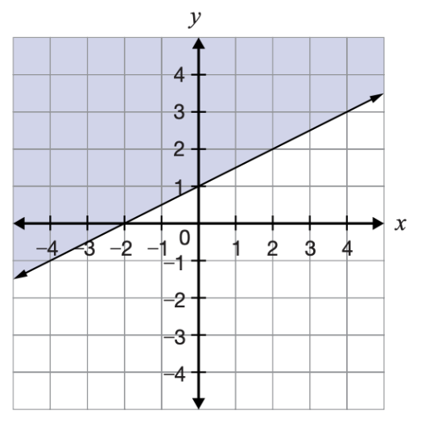

- #+BEGIN_CAUTION
  Today we will learn to describe inequalities using our knowledge of Linear Relations to further model interesting objects on graphs.
  #+END_CAUTION
- ## Preparing for EQAO #.v-self-border
	- Here is a question posed on an #EQAO practice test. What do you understand about it? What do you notice that is *familiar*? What do you notice that is *not familiar*?
		- Which inequality corresponds to this graph? #.v-border-children 
		  logseq.order-list-type:: number
		  {:height 364, :width 382}
			- $2x-y\leq-2$
			  logseq.order-list-type:: number
			- $2x+y\le-2$
			  logseq.order-list-type:: number
			- $x-2y\le-2$
			  logseq.order-list-type:: number
			- $x+2y\le-2$
			  logseq.order-list-type:: number
- ## Warm Up #.v-self-border-children
	- An ==[[inequality]]== is a `True` or `False` statement using numbers.
		- Examples: Which of the following statements are `True`?
			- $3>4$
			- $4<3$
			- $3<4$
			- $3\leq3$
			- $3<3$
			- $3\leq-3$
			- $-3<3$
	- When we introduce variables, we begin asking questions where the answers are `True` or `False` Here is an example, **can you make up new questions to match** the ==[[subsequent]]== inequalities?
		- #eg $x<3$ is like the question:
			- "What numbers are less than 3?"
			- The answer $x=2$ is `True` while $x=4$ would `False`.
				- We can substitute to check:  $2<3$ is `True` and $4<2$ is `False`
		- $y>10$ - The Question you make:  "What numbers are \_\_\_\_ than \_\_\_\_?"
		- $n<-3$
		- $k>-5$
	- We can also match these questions to our number line. Here is an example, **can you draw number lines for the rest?**
		- #eg An open circle means it does not equal 2. So $x>2$ has this picture:
		  
		- $y\geq10$
		- $n<-3$
		- $k\geq-5$
		- Can you work backwards from the number line to write the inequality?
			- {:height 415, :width 551}
- ## Lesson #.v-self-border-children
	- We want to learn about these types of inequalities:
		- $y>2x+3$
		- **Strategy:** Graph the line $y=2x+3$ using [Desmos](https://desmos.com/calculator)
		  collapsed:: true
			- <iframe src = "https://www.desmos.com/calculator/4brddn7vio" style="height: 400px; width: 100%" ></iframe>
		- We can ask the question, like in the warm up, "What are the y-values greater than the line $2x+3$? Can you identify the ==[[region]]== of the graph this question is creating?
			- *Open this section to see the Solution.*
			  collapsed:: true
				- <iframe src = "https://www.desmos.com/calculator/f01d8fn3hi" style="height: 400px; width: 100%" ></iframe>
	- ### Watch this Video
		- <iframe width="560" height="420" src="https://www.youtube.com/embed/P_-c9D6mjGA?si=93BnTj_s2tu_Dwie" title="YouTube video player" frameborder="0" allow="accelerometer; autoplay; clipboard-write; encrypted-media; gyroscope; picture-in-picture; web-share" referrerpolicy="strict-origin-when-cross-origin" allowfullscreen></iframe>
		- But this still isn't the EQAO Question! What can we do with $2x-y\leq-2$ and the other answers?
			- We can guess points. We can try points inside the region, on the line, and outside the region.
				- {:height 364, :width 382}
				- Take the point (-1,1) which is inside the shaded region. If we want to find the correct answer to this question, we can check if that point is `True` for the possible answers. Check (-1,1) in
				- Check more points, can you use this strategy to locate the correct answer for the #EQAO question at the beginning of this lesson?
			- Or, we can use reasoning:  our goal is to get $+y$ on one side, just like solving, but we
				- $$ \begin{align*}
				  2x - y &< -2 \\
				  2x &< -2 + y \\
				  2x +2 &< y
				  \end{align*} $$
			- Can we now see why a. is not the answer to the EQAO question?
	- Exit Ticket:
		- Draw the region of the graph defined by $y<4x-5$.
		- Draw the region of the graph defined by $-4x-2y>6$.
- ## Practice #.v-self-border
	-