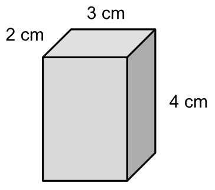
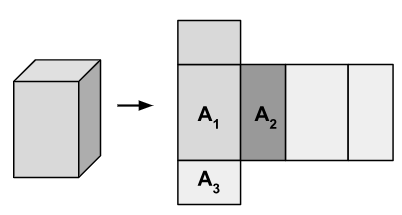

- #+BEGIN_CAUTION
  In this investigation, you will learn to ==[prove]([[proof]])== how changing dimensions of a solid will change its ==[[Volume]]== or ==[[Surface Area]]==.
  #+END_CAUTION
- ## Warm Up Exercises
	- Reference Formulas for a Rectangular Prism:
		- $V=LWH$
		- $SA = \sum \text{All Faces} = 2(LW+WH+LH)$
	- {:height 155, :width 164} {:height 134, :width 201}
	- For the two problems below, you want to create two very organized solutions that you will modify later.
		- Calculate the ==[[Volume]]== of a rectangular prism with $L=3$cm, $W=2$cm, and $H=4$cm.
		  logseq.order-list-type:: number
		- Calculate the ==[[Surface Area]]== of the same rectangular prism.
		  logseq.order-list-type:: number
- ## Action
	- If the width, $W$, is doubled from $2$ to $4$, draw new diagrams for the Volume (3D Solid) and Surface Area (2D Net). Predict what you think doubling the width will do to your calculated *Volume*.
	  logseq.order-list-type:: number
	- If all dimensions are doubled, what are the new Volume and Surface Area?
	  logseq.order-list-type:: number
	- Algebra is a very powerful language. If we alter our original formula for $V$ to have $2L$ instead of $L$, $2W$ instead of $W$, and $2H$ instead of $H$, this is what happens:
	  logseq.order-list-type:: number
	  $$V=2L2W2H$$
	  Simplify this formula so that it looks like $V=\#LWH$ what is $\#$?
		- Why are we substituting $2L$ and 2 times all the other dimensions? How is this related to question 2 above?
		  logseq.order-list-type:: number
		- What is the significance of $\#$ when we want to answer question 2?
		  logseq.order-list-type:: number
	- If all dimensions are tripled, how does the Volume change? Solve this problem without revisiting your warm-up solutions.
	  logseq.order-list-type:: number
	- If all dimensions are halved, how does the Volume change?
	  logseq.order-list-type:: number
- ## Consolidation
	- Determine the Volume of the each Solid. Use the EQAO Formula Sheet if necessary. It helps to know that the Volume for Prisms is always $V_{prism}=A_{base}\times h$.
	  logseq.order-list-type:: number
	- Determine the new Volume of the Rectangular Prism and the Cylinder above when **all** dimensions have been:
	  logseq.order-list-type:: number
		- Doubled
		  logseq.order-list-type:: number
		- Tripled
		  logseq.order-list-type:: number
		- Halved
		  logseq.order-list-type:: number
	- How does the Surface Area of the Rectangular Prism change from the original when all th
	  logseq.order-list-type:: number