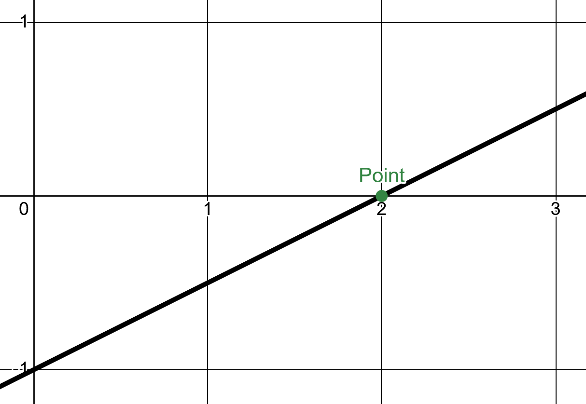

- #+BEGIN_TIP
  This is a fairly exhaustive list of common high school math errors named and categorized by the mathematical rule they break or misinterpret. Study this list well but make a personalized list for yourself.
  #+END_TIP
- ## Dropping a Negative
  collapsed:: true
	- #+BEGIN_IMPORTANT
	  Award Winner!  This error is the **most common** to make in high school.
	  #+END_IMPORTANT
	- #eg Imagine yourself calculating slope using the formula $m=\frac{y_2-y_1}{x_2-x_1}$:
		- $$ \begin{align}
		  m &= \frac{3-(-3)}{2-1} \\
		  &= \frac{0}{1}
		  \end{align} $$
		- Did you just see it? $3-(-3) = 3+3 = 6$ not $0$. By not showing the intermediary step of $3+3$ this student has *dropped a negative*.
	- To reliably avoid this error, always show intermediary steps, even in your practice, so you can look back at **every. single. calculation.** you have made during your process.
- ## Plot Twist
  collapsed:: true
	- #eg A point is plotted on a graph and can be seen in the following image:
		- {:height 424, :width 588}
		- The student describes this point as $\color{red} (0,2)$, either accidentally or intentionally writing the coordinates backwards. The actual point is $\color{green} (2,0)$ since all points are $(x,y)$ pairs, where $x$ is the horizontal coordinate and $y$ is the vertical coordinate.
	- To reliably avoid this error, always run (read $x$) before you rise (read $y$) when reading graphs.
- ## Copy Error
  collapsed:: true
	- #+BEGIN_IMPORTANT
	  Award Winner! This error is the **silliest** and *feels bad*. #oof
	  #+END_IMPORTANT
	- #eg A test has the formula $A=\frac{1}{2}\cdot l\cdot w$ for the Area of a Triangle. When a student goes to copy this formula for use in their math, this is what they write:
		- $$ \begin{align}
		  A &= l\cdot w
		  \end{align} $$
	- To reliably avoid this error, always re-read the statement of a problem before you begin solving and after you have finished each step.
- ## Brevity is the Soul of Wit
	- This is more of a stylistic choice than an error. However, this author has noticed that students who use [[AI]] to learn tend to alter the way they communicate [[Algebra]] to be more conversational and [[verbose]], as if they were a teacher and not the problem solver.
		- This author believes that Algebraic manipulation should not be interrupted on paper. It is better to use the Algebra to communicate reasoning than to explicitly state reasoning for a reader, unless you are a teacher, in which case you might explain steps by interjecting thoughts, reasons, and justifications. A two-column style can also be used to inject thoughts at each step of a solution which is especially useful in a [[proof]].
		- #eg Problem:  Given the line $3x+2y=1$ determine its y-intercept. Here, the student begins their solution:
			- Let's find the **y-intercept** of the line $3x+2y=1$.
			- ### Step 1: Write the equation in slope-intercept form
			  
			  The slope-intercept form of a line is:
			  
			  $y=mx+b$
			  
			  where $b$ is the y-intercept.
			  
			  Solve for $y$ in the equation $3x+2y=1$:
			  
			  $$2y=−3x+1$$
			  $$y = -\frac{3}{2}x + \frac{1}{2}$$​
			- ### Step 2: Identify the y-intercept
			  
			  The y-intercept is the constant term $b = \frac{1}{2}$​.
			  
			  Thus, the **y-intercept** is:
			  $$\boxed{\frac{1}{2}}$$​​
			  Or as a coordinate point:
			  $$\boxed{(0, \frac{1}{2})}$$
		- Stylistic choices to notice:
			- First of all, this answer was produced by ChatGPT for this article and not by a student. Could you tell upon first reading?
			- Second, there are frequent interruptions to explain when only **two** statements are necessary (as seen in the suggested solution that follows).
			-
- ## Spilling the t
  collapsed:: true
	- #eg #MCV4U A symmetric equation is given by $\frac{x-2}{3}=\frac{y-1}{4}$ and a student is asked to write the parametric equations. Either:
		- The student does not know how, claiming there is no $t$ so how can they make the parametric equations?
		- Or, when the parametric equations are made: $\begin{cases}x=2+3t\\ y=1+4t\end{cases}$, the student forgets to define the parameter $t$ as "for $t\in\R$" or "Let $t\in\R$.
	- To reliably avoid this error, students need to have a strong understanding of functions as relations on [sets]([[set]]). All variables needs to be [[well-defined]] with sets or else paradoxes and contradictions can occur.
		- In this specific case, not defining the [[universal set]] clearly can result clarity errors. What if $t$ is a vector? What if $t$ is an integer? What if $t$ is another set? We simply do not know until it is clearly defined.
			- While in MCV4U, $t$ is rarely not $\in\R$ it is best practice to build these habits for future courses and communications.