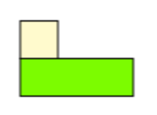
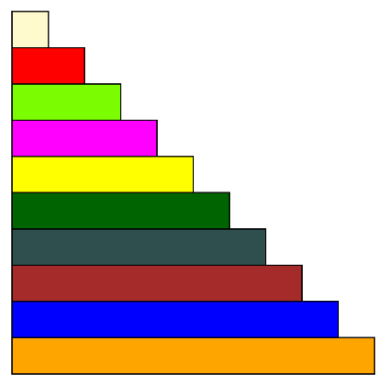

- #definiton Relational Rods, brand name cuisenaire rods, are a set of coloured plastic lengths. There are ten of the smallest pieces in one of the largest pieces.
- #eg The fraction $\frac13$ can be represented with any of the following or more. #.v-gallery-fit
	- {:height 92, :width 96}
	- {:height 70, :width 164}
	- {:height 71, :width 230}
	- {:height 78, :width 320}
- [Relational Rods Digital Manipulative](https://mathsbot.com/manipulatives/rods)
- {:height 432, :width 398}