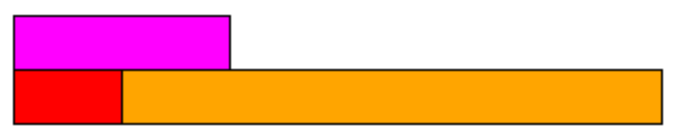

- #definiton Relational Rods, brand name cuisenaire rods, are a set of coloured plastic lengths. There are ten of the smallest pieces in one of the largest pieces.
	- #### Vocabulary
		- A **pairing** or **relation** is when you create two rows of rods that will be compared for sizes.
		- A **1-rod** is the smallest rod. A **10-rod** is the largest. Each rod in between is named similarly, eg. **2-rod**.
		- A **fraction** is a relation between two
- #eg The fraction $\frac13$ can be represented with any of the following or more. #.v-gallery-col1
  Can you see why each of these relational rods is $\frac13$? How can the fact that $\frac13=\frac26=\frac39=\frac{4}{12}$ be used to explain why each of these pairings is $\frac13$?
	- {:height 92, :width 96}
	- {:height 70, :width 164}
	- {:height 71, :width 230}
	- {:height 78, :width 320}
- [Relational Rods Digital Manipulative](https://mathsbot.com/manipulatives/rods)
- {:height 432, :width 398}